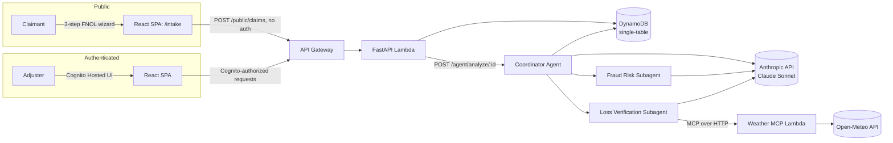
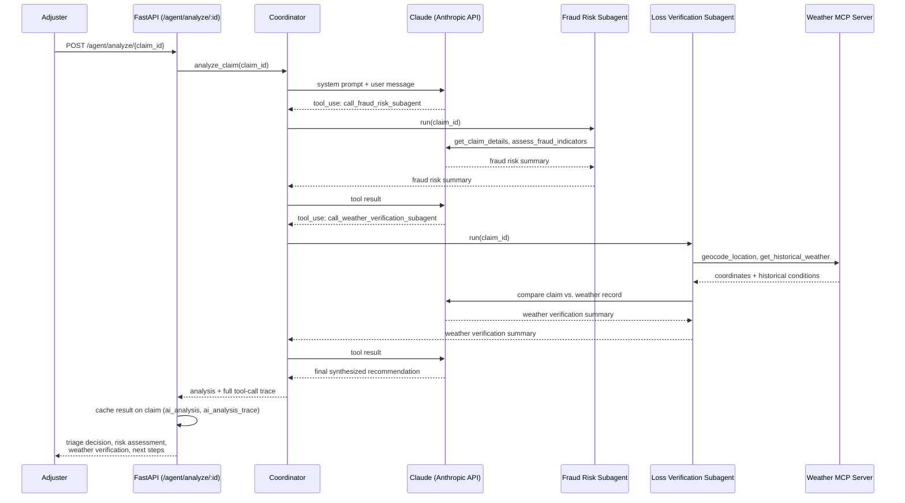

# Claim Flow

**An AWS-native P&C claims workflow orchestrator with a multi-agent AI assistant for claim triage.**

Claimants report a loss through a public First Notice of Loss (FNOL) wizard. Claims are auto-triaged on submission, then an adjuster can request an AI-generated analysis — built on a real multi-agent system, not a single prompt — that delegates to a fraud-risk specialist and a loss-verification specialist (the latter cross-referencing the claim against real historical weather data over MCP), then synthesizes a single recommendation.

This project exists to demonstrate a production-shaped agentic AI system on AWS: real auth, real data modeling, real infrastructure-as-code, and a multi-agent, MCP-integrated system whose tool-calling behavior is explainable end to end.

**Who this is for:** P&C carriers, MGAs, and insurtech teams who want to modernize claims triage with explainable agentic AI rather than opaque black-box scoring.

---

## Overview

- **Adjusters** log in (Cognito, invite-only) to a dashboard showing the claims queue, and can drill into any claim for detail, status management, and AI-assisted analysis.
- **Claimants** submit a loss report through a fully public, unauthenticated 3-step intake wizard — no account required.
- Every submitted claim is **auto-triaged** by server-side rules into one of three handling paths.
- Adjusters can trigger a **coordinator agent** — calling directly into the Anthropic API — that delegates to a fraud-risk subagent and a loss-verification subagent, then produces a structured recommendation: triage decision, risk assessment, weather verification, next steps, and missing information.

## Highlights

- End-to-end AWS stack (Cognito, API Gateway, Lambda, DynamoDB, CloudFront + S3) with IaC via SAM.
- A hand-rolled **coordinator + subagents** architecture on the direct Anthropic API (Claude Sonnet) — no agent framework, just the Messages API tool-use loop, so the mechanics stay fully visible.
- One subagent calls a **standalone MCP server** (its own Lambda) that wraps a free historical-weather API, to fact-check weather-related claims against what actually happened.
- Auto-triage rules at intake plus cached AI analyses — including the full multi-agent tool-call trace — on claim records.
- Three environments (dev, QA, prod) each with separate auth and data stacks.
- Frontend React/Vite SPA with public FNOL wizard and authenticated adjuster dashboard, including a collapsible agent-trace view.

## Architecture

| Layer | Technology |
|---|---|
| Frontend | React + TypeScript + Vite SPA |
| Auth | Amazon Cognito (invite-only, hosted UI, role groups) |
| API | FastAPI on AWS Lambda (via Mangum), behind API Gateway |
| Data | DynamoDB, single-table design |
| Agentic AI | Direct Anthropic API (Claude Sonnet) — hand-rolled coordinator + subagents |
| Tool Integration | [Model Context Protocol](https://modelcontextprotocol.io/) — standalone weather MCP server, its own Lambda |
| Infrastructure | AWS SAM (CloudFormation) |
| Hosting | CloudFront + S3 (frontend) |



## Agentic Claim Analysis

The centerpiece of this project is a small but real multi-agent system — not a single LLM call dressed up as "AI."

`backend/services/claims_agent_service.py` implements an **orchestrator-workers** pattern directly on the Anthropic Messages API: a coordinator agent whose "tools" are two specialist subagents, each running its own independent tool-use loop.

- **Coordinator** — has two tools, `call_fraud_risk_subagent` and `call_weather_verification_subagent`. Calling either one runs the corresponding subagent's full tool loop and returns its final text as the tool result. The coordinator then synthesizes both findings into one adjuster-facing recommendation, and can override either subagent (e.g. escalate to Manual Review or SIU) if their findings conflict.
- **Fraud Risk subagent** — tools: `get_claim_details` (reads the claim from DynamoDB) and `assess_fraud_indicators`, a deterministic, rules-based check (claim amount thresholds, loss-type risk, red-flag language in the claimant's description). This is plain Python, not the model — the subagent orchestrates it, it doesn't reason it out.
- **Loss Verification subagent** — tools: `get_claim_details` plus two tools discovered dynamically from a **standalone MCP server** (`backend/weather_mcp/`, its own Lambda) over HTTP: `geocode_location` and `get_historical_weather`, both backed by the free Open-Meteo API. This subagent checks whether a claimed weather event (storm, hurricane, flood, etc.) actually happened at the loss date and location — a genuine remote MCP integration, not an in-process function call.

Every tool call across all three agents — internal or MCP-sourced — is recorded to a flat trace and returned alongside the analysis, powering the "Agent Trace" panel in the UI.



**Worth understanding, not just showing:** the call order above isn't enforced by any code — no step-1-then-step-2 control flow exists in Python. It's driven entirely by each agent's system prompt, which gives the model plain-English step-by-step instructions; the model's own reasoning over those instructions produces the sequence. This is "prompt-as-control-flow," and it's a deliberate, honest characteristic of this design, not a gap. It's also why each system prompt is treated as a first-class, carefully-written artifact rather than an afterthought.

**Why hand-rolled, not a framework:** the tool-use loop, the orchestrator-workers delegation, and the MCP client wiring are all built by hand on the raw Anthropic SDK rather than via a higher-level agent framework. That's a deliberate choice — it keeps the underlying mechanics (`tool_use`/`tool_result` blocks, MCP `list_tools`/`call_tool`) fully visible rather than hidden behind config, and avoids pulling a Node.js runtime into a Python Lambda.

Results — the analysis text and the full trace — are cached onto the claim record in DynamoDB (`ai_analysis`, `ai_analysis_trace`, `ai_analysis_at`) so re-viewing a claim doesn't re-run the agents; adjusters can force a fresh run with `?force=true`.

## Auto-Triage Logic

Applied automatically at intake, before any AI involvement (`backend/api/claim_api.py`):

| Condition | Triage Result |
|---|---|
| `loss_type == "liability"` | SIU (Special Investigations Unit) |
| `estimated_amount > $50,000` | SIU |
| `loss_type == "auto"` | Straight-through processing |
| everything else | Manual review |

## Environments

Three environments — local dev, QA, and prod — deployed as separate AWS SAM stacks, each with its own Cognito pool, DynamoDB table, and API Gateway stage. See `CLAUDE.md` for deploy commands and full environment configuration.

## Getting Started

```
# Frontend
cd frontend && npm install && npm run dev

# Backend — needs ANTHROPIC_API_KEY and WEATHER_MCP_URL set in backend/.env
cd backend
python -m venv .venv && .venv\Scripts\Activate.ps1
pip install -r requirements.txt
uvicorn api.app:app --reload

# Weather MCP server — run alongside the backend, in a separate terminal
cd backend
uvicorn weather_mcp.app:app --port 8001 --reload

# Infrastructure
cd infrastructure
sam build
sam deploy --guided --config-env qa
```

Before a QA/prod deploy, the Anthropic API key must be created in Secrets Manager once per environment — see [`CLAUDE.md`](CLAUDE.md) for the exact command.

Full command reference, environment variables, and architecture conventions are in [`CLAUDE.md`](CLAUDE.md).

## Screenshots

_TODO: dashboard, intake wizard, agent analysis output_

## Roadmap

- **Managed agent runtime** — the coordinator and subagents run inline, synchronously, inside the API Lambda, which is appropriate for this demo's scale. A managed agent runtime (session memory, identity, observability, retries) would be the natural next step for productionizing multi-tenant or higher-scale agent workloads.
- **More MCP servers** — the weather MCP server proves the pattern; policy documents, catastrophe/CAT event feeds, or claims-history systems are natural next candidates for additional subagents to call over MCP.
