# AI Claims Analyst — Sequence Diagram (per LLM call)

Companion diagram to [ai-analyst-steps.md](ai-analyst-steps.md). Every arrow into/out of
**Claude** is one of the 10 `_client.messages.create` calls made for a single
"Analyze with AI" click. Arrows into **DynamoDB** and **Weather MCP Server** are plain
tool execution — no LLM involved.

```mermaid
sequenceDiagram
    participant Adjuster
    participant API as FastAPI (/agent/analyze/:id)
    participant Coord as Coordinator
    participant Claude
    participant Fraud as Fraud Risk Subagent
    participant Weather as Loss Verification Subagent
    participant DB as DynamoDB (repository layer)
    participant MCP as Weather MCP Server (WeatherMcpFunction)

    Adjuster->>API: POST /agent/analyze/{claim_id}
    API->>Coord: analyze_claim(claim_id)

    rect rgb(40, 50, 70)
    note over Coord,Claude: Coordinator turn 1
    Coord->>Claude: LLM call #1 — system prompt + "Analyze claim {id}..."
    Claude-->>Coord: tool_use: call_fraud_risk_subagent
    end

    Coord->>Fraud: run(claim_id)  (nested tool loop)

    rect rgb(40, 60, 50)
    note over Fraud,DB: Fraud subagent turn 1
    Fraud->>Claude: LLM call #2 — "Assess fraud risk for claim {id}."
    Claude-->>Fraud: tool_use: get_claim_details
    Fraud->>DB: get_claim(claim_id)
    DB-->>Fraud: claim record
    end

    rect rgb(40, 60, 50)
    note over Fraud,Claude: Fraud subagent turn 2
    Fraud->>Claude: LLM call #3 — tool_result: claim record
    Claude-->>Fraud: tool_use: assess_fraud_indicators
    Fraud->>Fraud: rules check (amount, loss_type, red-flag keywords)
    end

    rect rgb(40, 60, 50)
    note over Fraud,Claude: Fraud subagent turn 3 (final)
    Fraud->>Claude: LLM call #4 — tool_result: risk level + factors
    Claude-->>Fraud: final text: fraud risk summary
    end

    Fraud-->>Coord: fraud risk summary

    rect rgb(40, 50, 70)
    note over Coord,Claude: Coordinator turn 2
    Coord->>Claude: LLM call #5 — tool_result: fraud summary
    Claude-->>Coord: tool_use: call_weather_verification_subagent
    end

    Coord->>Weather: run(claim_id)  (nested tool loop)
    Weather->>MCP: initialize() + list_tools()
    MCP-->>Weather: geocode_location, get_historical_weather (discovered at runtime)

    rect rgb(60, 50, 40)
    note over Weather,DB: Weather subagent turn 1
    Weather->>Claude: LLM call #6 — "Verify the reported loss conditions for claim {id}."
    Claude-->>Weather: tool_use: get_claim_details
    Weather->>DB: get_claim(claim_id)
    DB-->>Weather: location, date_of_loss
    end

    rect rgb(60, 50, 40)
    note over Weather,MCP: Weather subagent turn 2
    Weather->>Claude: LLM call #7 — tool_result: claim location/date
    Claude-->>Weather: tool_use: geocode_location
    Weather->>MCP: geocode_location(location)
    MCP-->>Weather: coordinates (Open-Meteo geocoding API)
    end

    rect rgb(60, 50, 40)
    note over Weather,MCP: Weather subagent turn 3
    Weather->>Claude: LLM call #8 — tool_result: coordinates
    Claude-->>Weather: tool_use: get_historical_weather
    Weather->>MCP: get_historical_weather(lat, lon, date)
    MCP-->>Weather: historical conditions (Open-Meteo archive API)
    end

    rect rgb(60, 50, 40)
    note over Weather,Claude: Weather subagent turn 4 (final)
    Weather->>Claude: LLM call #9 — tool_result: historical weather record
    Claude-->>Weather: final text: weather verification summary
    end

    Weather-->>Coord: weather verification summary

    rect rgb(40, 50, 70)
    note over Coord,Claude: Coordinator turn 3 (final)
    Coord->>Claude: LLM call #10 — tool_result: weather summary
    Claude-->>Coord: final text: Triage Decision / Risk Assessment /<br/>Weather Verification / Suggested Next Steps / Missing Information
    end

    Coord-->>API: analysis text + full tool-call trace
    API->>API: cache on claim (ai_analysis, ai_analysis_trace, ai_analysis_at)
    API-->>Adjuster: rendered recommendation + Agent Trace panel
```

**Reading this diagram:** all 10 `LLM call #N` arrows are sequential — there is no
concurrency anywhere in this flow. The coordinator waits for the fraud subagent's entire
nested loop to finish (calls #2-#4) before making its next call to Claude, and likewise
waits for the weather subagent's entire nested loop (calls #6-#9) before its final
synthesis call (#10). Everything drawn against `DB` and `MCP` is a direct
function/HTTP call — never a hop back through Claude.
